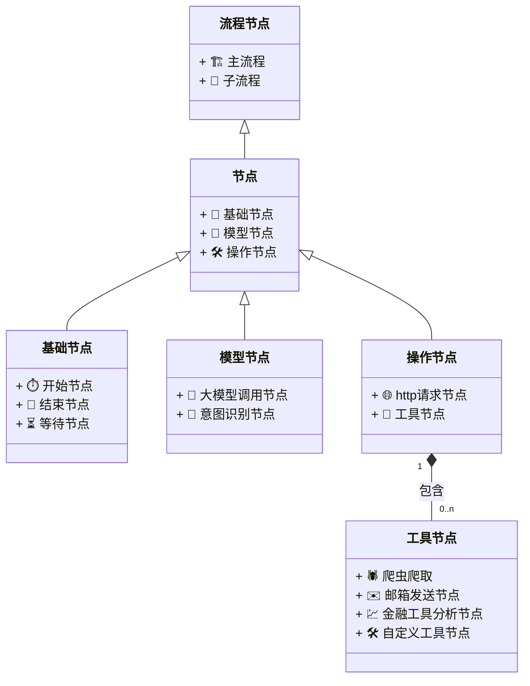

# 目的

ai-bots 这个项目的意义是 能够让你自由组合你的流程轻松的 搭建 你自己的ai 助理, 例如股票分析助手，代码review助手

# 概念

## 节点

### 基础节点

#### 开始节点

能够自定义触发时机，例如 定时任务,手动触发

#### 结束节点

能够自定义返回值

#### 等待节点

见文知意

### 模型节点

#### 大模型调用节点

能够选择模型和模型的参数

#### 意图识别节点

用function call来做意图识别识别并且调用相关的工具/操作节点集合

### 操作节点

#### http请求节点

能够自定义请求http

#### 工具节点

- 爬虫爬取
- 邮箱发送节点
- 金融工具分析节点
- 自定义工具节点...

### 流程/agent 节点

以上的所有节点的组合我们管他叫做agent 或者 一个流程

可以通过组合自由编排各个节点和各个agent，分成主agent和次agent

本质上是一层树状的json结构

# 数据结构

(...调研中)