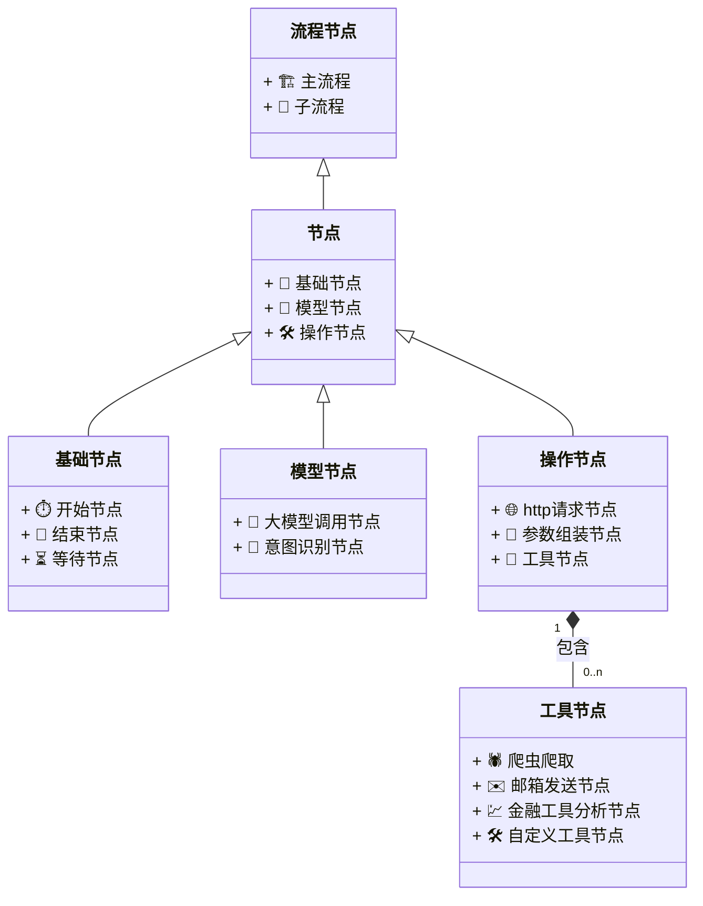

# 目的

ai-bots 这个项目的意义是 能够让你自由组合你的流程轻松的 搭建 你自己的ai 助理, 例如股票分析助手，代码review助手



# 概念

## 节点

### 1. 基础节点

#### 1.1 开始节点

能够自定义触发时机，例如 定时任务,手动触发

```json
{
    "id": "562523415696556032",
    "name": "开始节点",
    "type": "node-start",
    "next_nodes": any
}
```


#### 1.2 结束节点

能够自定义返回值

```json
{
    "id": "562523415696556032",
    "name": "结束节点",
    "type": "node-end",
    "next_nodes": any,
    "param": {
        content: {
            type: "form",
            fields: [
                {
                    type: "input",
                    value: "123"
                }
            ]
        }
    }
}
```

#### 1.3 等待节点

见文知意

### 2.模型节点

#### 2.1 大模型调用节点

能够选择模型和模型的参数

```json
{
    "id": "大模型调用节点-562522466710110208",
    "name": "大模型调用节点",
    "type": "node-model",
    "param": {
        "modal": "DeepSeek-V3",
        "knowledge_config": {
            "max_recall_num": 10,
            "min_recall_score": 0.5,
            "knowledge_id": null
        },
        "system_prompt": [{
            "type": "input",
            "value": "你是一个股票分析师，请根据用户的问题给出相应的回答"
        },{
            "type": "field",
            // value的含义是 节点id.属性
            "value": "开始节点123.name"
        }]
    },
    "output":{
        "type": "form",
        "id": "component-677633dfaf392",
        "content": [
            {
                "type": "response",
                "key": "response",
                "description": "大模型调用节点的返回值"
            }
        ]
    },
    "next_nodes": any
}
```
#### 2.2 意图识别节点(暂时不做)

用function call来做意图识别识别并且调用相关的工具/操作节点集合

### 3. 操作节点

#### 3.1 http请求节点

能够自定义请求http

#### 3.2 条件/选择器节点

```
{
    "params": {
        "branches": [
            {
                "branch_type": "if",
                "next_nodes": [
                    
                ],
                "parameters": {
                    "type": "condition",
                    "content": {
                        "ops": "AND",
                        "children": [
                            {
                                "type": "compare",
                                "left_operands": {
                                    "type": "expression",
                                    "value": [
                                        {
                                            "type": "fields",
                                            "value": "562523415696556032.message_content"
                                        }
                                    ]
                                },
                                "condition": "equals",
                                "right_operands": {
                                    "type": "const",
                                    "value": [
                                        {
                                            "type": "input",
                                            "value": "2"
                                        }
                                    ]
                                }
                            }
                        ]
                    }
                }
            },
           
        ],
    },
    "id": any,
    "next_nodes": any,
    
    "name": "选择器"
}
```


#### 3.3 工具节点

- 爬虫爬取
- 邮箱发送节点
- 金融工具分析节点
- 自定义工具节点...

### 流程/agent 节点

以上的所有节点的组合我们管他叫做agent 或者 一个流程

可以通过组合自由编排各个节点和各个agent，分成主agent和次agent

本质上是一层树状的json结构

# 数据结构

(...调研中)


node 里面 基本的原则是
- next_nodes: 连接各个节点， 是一个node ids 的数组
- input 是定义传入的参数，目前只作用于开始节点
- output 是定义返回的参数

注意: content 的 key 里面的所有东西，都会注册到一个全局的object中，因此key 的值需要是唯一的


一个有着开始节点，大模型节点，结束节点的示例是这样的
```ts
[{
    "id": "开始节点-123",
    "version": "v1",
    "type": "node-base",
    "name": "开始节点",
    "parent_nodes": "",
    "next_nodes": ["大模型节点-456"],
    "param":{
        "trigger": "api",
    },
    "input":{
        /**
         定义传入的参数，这样传入的api就是下面这样
        {
            api_role: "123",
            api_content: "456"
        }
        */
       "type": "form",
        "content": [{
            "type": "key",
            "value": "api_role"
        },{
            "type": "key",
            "value": "api_content"
        }]
    }
},
{
    "id": "大模型节点-456",
    "version": "v1",
    "type": "node-model",
    "param":{
        modal: "DeepSeek-V3",
        knowledge_config: {
            // 最大召回数 知识库返回模型的最大段落
            max_recall_num: 10,
            // 最小匹配度 低于这个匹配度将不会返回
            min_recall_score: 0.5,
            // 召回知识库
            knowledge_id: null,
        },
        content: [{
            type: "field",
            value: "开始节点-123[0].api_content"
        }],
        system_prompt: [{
            type: "input",
            value: "你是一个"
        },{
            type: "field",
            // type 节点id.属性
            value : "开始节点-123[0].api_role"
        },{
            type: "input",
            // type 节点id.属性
            value : "，请根据用户的问题给出相应的回答"
        }] 
    },
    "input":{
        "type": "form",
        "content": [{
            "type": "key",
            "value": ""
        }]
    },
    "output":{
        "type": "form",
        "id": "component-677633dfaf392",
        "content": [
            {
                "type": "response",
                "key": "response",  
                "description": "大模型调用节点的返回值"
            }
        ]
    },
},
{
    "id": "结束节点-123",
    "version": "v1",
    "type": "node-end",
    "output": {
        "type": "form",
        "id": "component-677633dfaf392",
        "content": [
            {
                "type": "field",
                "key": "data",
                "value": "大模型节点-456.response",
                "description": "结束节点的返回值"
            }
        ]
    },
    "next_nodes": []
}
]

```

在我们定义了这个数据结构后，我们应该只需要传入
{
    "api_role": "股票分析师",
    "api_content": "请问最近适合投资什么行业"
}

输出是这样的返回值
{
    "data": any
}


注意，最后在 我给你的 mvp 文件夹下面生成一个最小示例demo， 然后运行起来